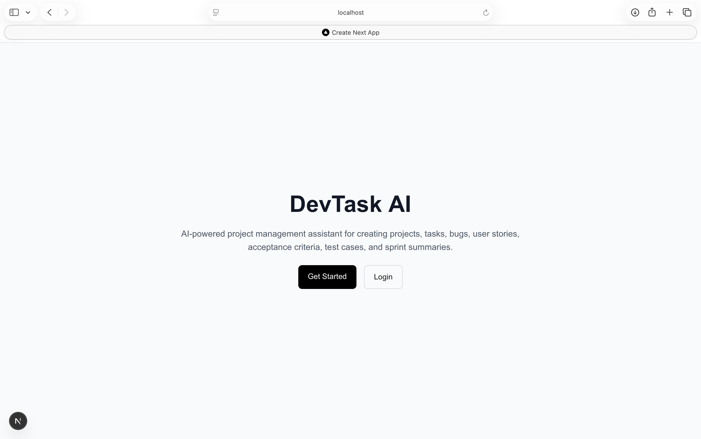
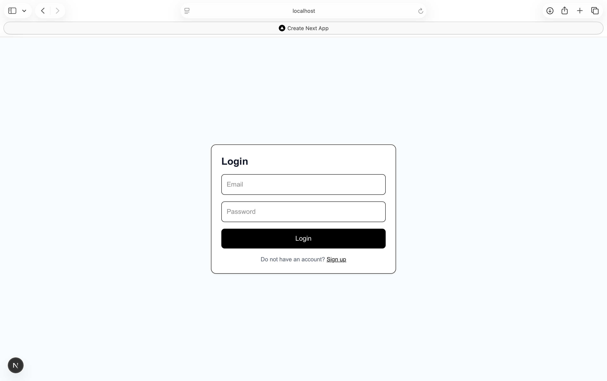
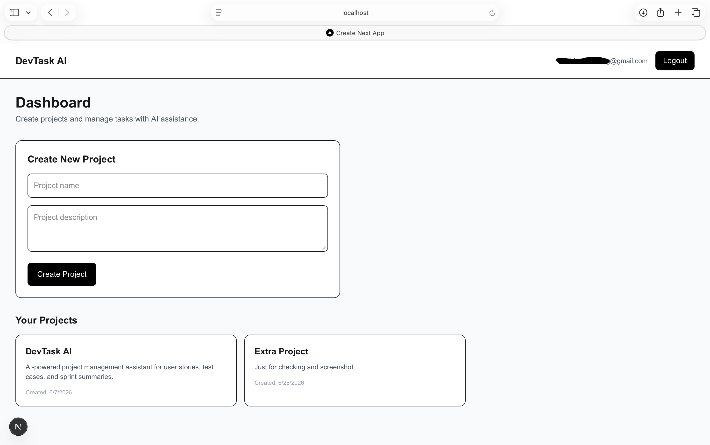
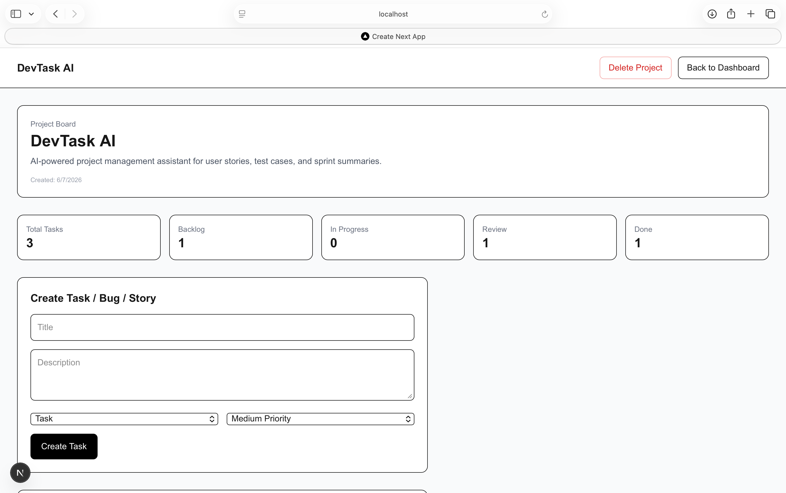
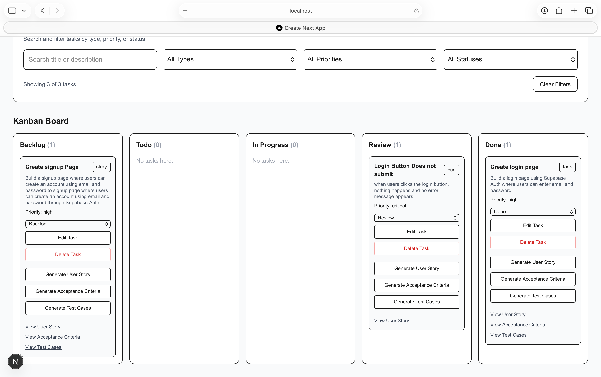
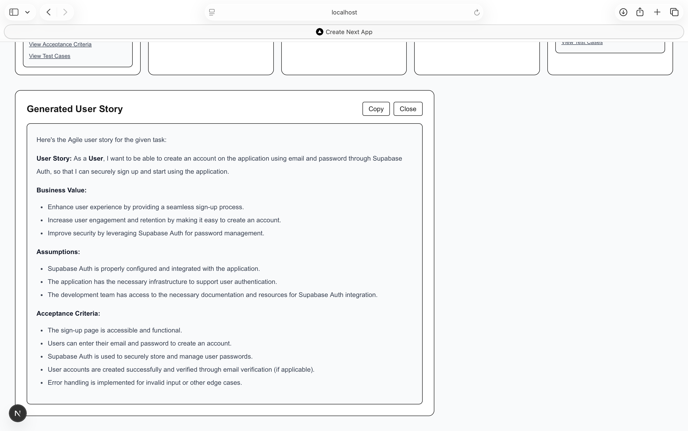
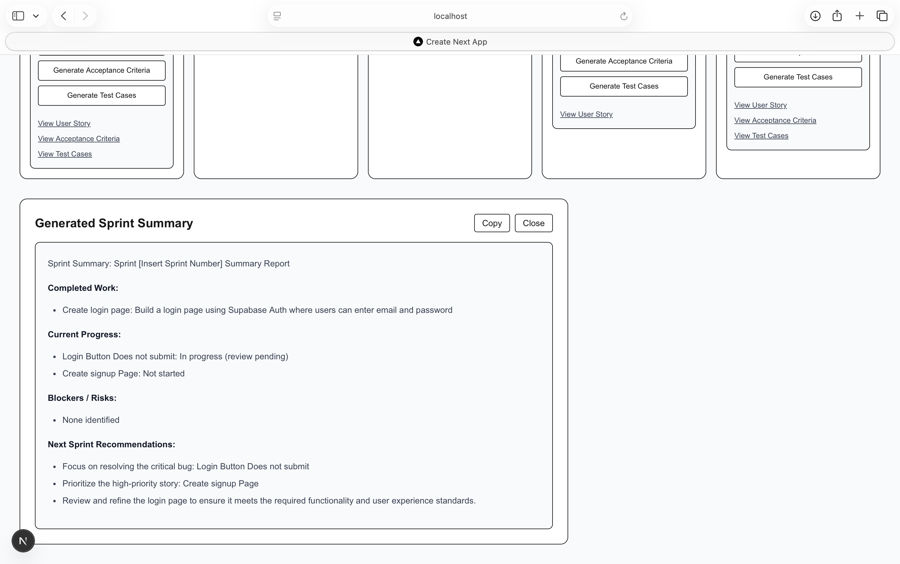

# DevTask AI

DevTask AI is a full-stack AI-powered project management platform that helps users create projects, manage tasks and bugs through a Kanban workflow, and generate Agile documentation using large language models.

The platform converts software requirements into user stories, acceptance criteria, test cases, and sprint summaries.

## Features

- User signup, login, and logout with Supabase Auth
- Create and manage software projects
- Create tasks, bugs, and user stories
- Five-column Kanban workflow
- Edit and delete tasks
- Delete projects with cascading task deletion
- Search and filter tasks by title, type, priority, and status
- AI-generated user stories
- AI-generated acceptance criteria
- AI-generated test cases
- AI-generated sprint summaries
- Database-backed AI output storage
- Project progress statistics
- Formatted Markdown output
- Responsive web interface

## Tech Stack

### Frontend

- Next.js
- React
- TypeScript
- Tailwind CSS
- Supabase Auth
- React Markdown
- Remark GFM

### Backend

- FastAPI
- Python
- Pydantic
- Supabase Python client
- Groq LLM API

### Database and Authentication

- Supabase PostgreSQL
- Supabase Auth

### Deployment

- Vercel for the frontend
- Render for the backend
- Supabase for the database and authentication

## Application Architecture

```text
User
  |
  v
Next.js Frontend
  |
  | REST API requests
  v
FastAPI Backend
  |
  |------------------------|
  v                        v
Supabase PostgreSQL        Groq LLM API
  |
  v
Projects, Tasks,
Sprint Notes,
AI-Generated Content
```

## Screenshots

### Landing Page



### Login Page



### Project Dashboard



### Project Board



### Kanban Board



### AI-Generated User Story



### Sprint Summary



## Project Structure

```text
devtask-ai/
├── backend/
│   ├── app/
│   │   ├── main.py
│   │   ├── config.py
│   │   ├── supabase_client.py
│   │   ├── projects.py
│   │   ├── tasks.py
│   │   └── ai.py
│   ├── requirements.txt
│   └── .env
│
├── frontend/
│   ├── app/
│   │   ├── dashboard/
│   │   ├── login/
│   │   ├── signup/
│   │   ├── projects/
│   │   └── page.tsx
│   ├── lib/
│   │   ├── api.ts
│   │   └── supabaseClient.ts
│   ├── components/
│   ├── package.json
│   └── .env.local
│
├── screenshots/
├── README.md
└── .gitignore
```

## Database Schema

### Projects

```text
id
user_id
name
description
created_at
```

### Tasks

```text
id
project_id
user_id
title
description
type
status
priority
ai_user_story
ai_acceptance_criteria
ai_test_cases
due_date
created_at
updated_at
```

### Sprint Notes

```text
id
project_id
user_id
title
notes
ai_summary
created_at
```

## API Endpoints

### Projects

```text
POST   /projects/
GET    /projects/user/{user_id}
GET    /projects/{project_id}
PATCH  /projects/{project_id}
DELETE /projects/{project_id}
```

### Tasks

```text
POST   /tasks/
GET    /tasks/project/{project_id}
GET    /tasks/{task_id}
PATCH  /tasks/{task_id}
PATCH  /tasks/{task_id}/status
DELETE /tasks/{task_id}
```

### AI

```text
POST /ai/user-story
POST /ai/acceptance-criteria
POST /ai/test-cases
POST /ai/sprint-summary
```

## Local Setup

### 1. Clone the repository

```bash
git clone YOUR_GITHUB_REPOSITORY_URL
cd devtask-ai
```

### 2. Set up the backend

```bash
cd backend
python3 -m venv venv
source venv/bin/activate
pip install -r requirements.txt
```

Create this file:

```text
backend/.env
```

Add:

```env
SUPABASE_URL=your_supabase_project_url
SUPABASE_SERVICE_ROLE_KEY=your_supabase_service_role_key
GROQ_API_KEY=your_groq_api_key
```

Start the backend:

```bash
uvicorn app.main:app --reload
```

The backend runs at:

```text
http://localhost:8000
```

FastAPI documentation:

```text
http://localhost:8000/docs
```

### 3. Set up the frontend

Open another terminal:

```bash
cd frontend
npm install
```

Create this file:

```text
frontend/.env.local
```

Add:

```env
NEXT_PUBLIC_SUPABASE_URL=your_supabase_project_url
NEXT_PUBLIC_SUPABASE_ANON_KEY=your_supabase_anon_key
NEXT_PUBLIC_API_URL=http://localhost:8000
```

Start the frontend:

```bash
npm run dev
```

The frontend runs at:

```text
http://localhost:3000
```

## Environment Variables

Never commit these files:

```text
backend/.env
frontend/.env.local
```

The Supabase service-role key must only be used in the backend.

## AI Workflow

1. A user creates a project and task.
2. The frontend sends the task data to the FastAPI backend.
3. The backend creates a structured prompt.
4. The prompt is sent to the Groq LLM API.
5. The generated response is returned to the frontend.
6. The generated output is saved in Supabase PostgreSQL.
7. The frontend displays the content as formatted Markdown.

## Current Limitations

- Backend routes currently use the Supabase service-role key.
- Additional backend authentication validation should be added before production use.
- Sprint summaries should use the authenticated user's real ID.
- Row Level Security policies should be configured for stronger access control.

## Future Improvements

- Drag-and-drop Kanban cards
- Task activity history
- Team invitations
- Role-based access control
- File attachments
- Due-date reminders
- AI-generated sprint planning
- Unit tests
- Integration tests
- Backend JWT validation
- Supabase Row Level Security policies
- Dashboard analytics

## Resume Description

Built DevTask AI, a full-stack AI-powered project management platform using Next.js, FastAPI, Supabase PostgreSQL, Supabase Auth, and Groq LLM APIs. Implemented authenticated project workspaces, Kanban task management, REST APIs, task filtering, and AI-generated user stories, acceptance criteria, test cases, and sprint summaries.

## Author

Rohan Jaiswal